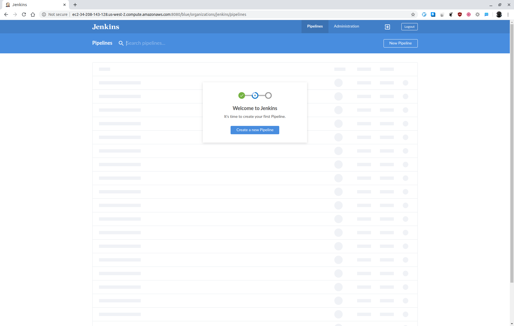
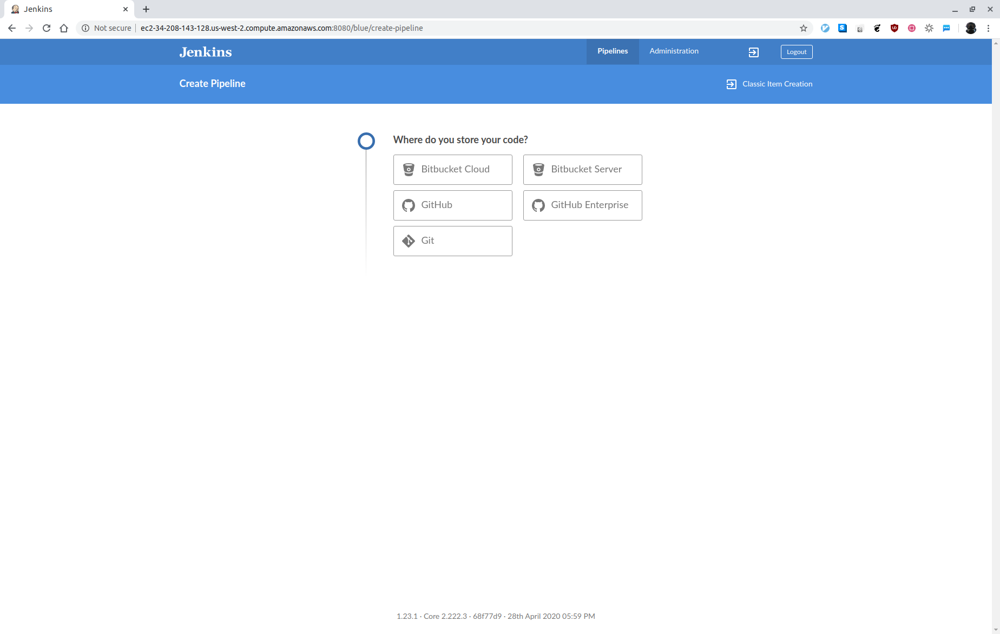

# Udacity Cloud DevOps Engineer Nanodegree Program - Capstone

## Setup Jenkins

[Setup a Jenkins build server](https://aws.amazon.com/getting-started/hands-on/setup-jenkins-build-server/) and install the [Blue Oceans plugin](https://www.jenkins.io/doc/book/blueocean/getting-started/).

Open Blue Ocean and create a new pipeline:

Select GitHub:

Select the correct repository:

## Requirements

Graded according to the [Project Rubric](https://review.udacity.com/#!/rubrics/2577/view).

## License

- **[MIT license](http://opensource.org/licenses/mit-license.php)**
- Copyright 2020 © [Thomas Weibel](https://github.com/thom).