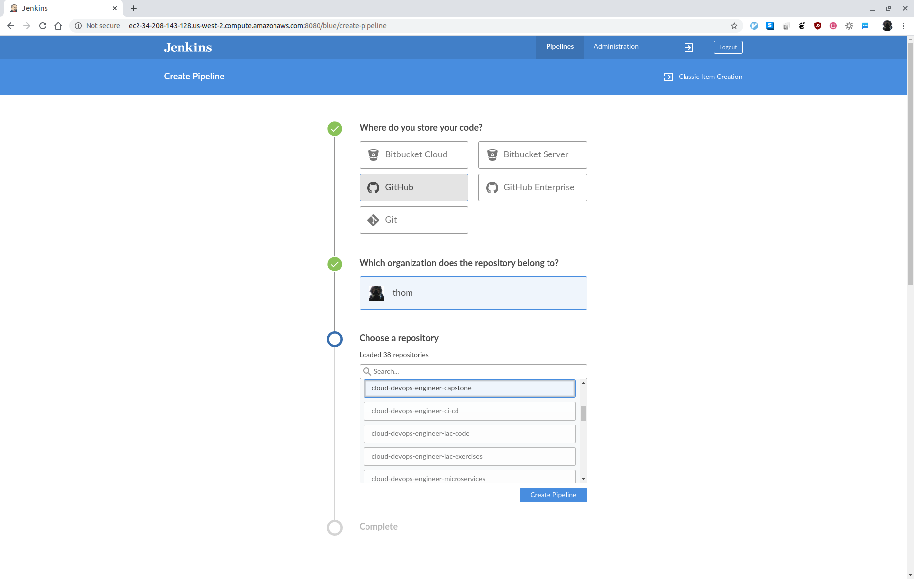

# Udacity Cloud DevOps Engineer Nanodegree Program - Capstone

This project applies the skills and knowledge which were developed throughout the Cloud DevOps Engineer Nanodegree program. These include:

* Working in AWS
* Using Jenkins to implement Continuous Integration and Continuous Deployment
* Building pipelines
* Working with CloudFormation to deploy clusters
* Building Kubernetes clusters
* Building Docker containers in pipelines

It develops a CI/CD pipeline for a micro services application (simple website with nginx) with rolling deployment. It also contains Continuous Integration steps. Continuous Deployment includes:

* Pushing the built Docker container to the Docker Hub repository
* Deploying the Docker container to a small Kubernetes cluster on AWS EKS

## Setup Jenkins and Blue Ocean

[Setup a Jenkins build server](https://aws.amazon.com/getting-started/hands-on/setup-jenkins-build-server/) and install the [Blue Oceans plugin](https://www.jenkins.io/doc/book/blueocean/getting-started/).

Open Blue Ocean and create a new pipeline:


Select GitHub:


Select the correct repository:



Update the scan repository triggers in the pipeline settings to periodically scan every minute:


Add Docker Hub credentials:


## Kubernetes cluster implementation

The repository contains two Amazon EKS cluster implemenations: CloudFormation script and [eksctl](https://eksctl.io/).

### CloudFormation

Execute the following script in the `cfn` folder:

```
# Create the network stack
01-create-vpc-stack.sh 

# Create the EKS cluster stack
02-create-eks-cluster-stack.s

# Create the EKS node group stack
03-create-eks-node-group-stack.sh
```

Also execute `04-aws-auth-cm.sh` to enable worker nodes to join your cluster. Don't forget to replace the ARN of the instance role (not instance profile) with yours in `aws-auth-cm.yml`.

### eksctl

Execute `eksctl.sh` in the `k8s` folder to use [eksctl](https://eksctl.io/) for the Amazon EKS cluster creation.

## Screenshots

Failed Linting:


Successful Linting:


Successful deployment:


Cluster:


Deployed website:


## Requirements

Graded according to the [Project Rubric](https://review.udacity.com/#!/rubrics/2577/view).

## License

- **[MIT license](http://opensource.org/licenses/mit-license.php)**
- Copyright 2020 © [Thomas Weibel](https://github.com/thom).